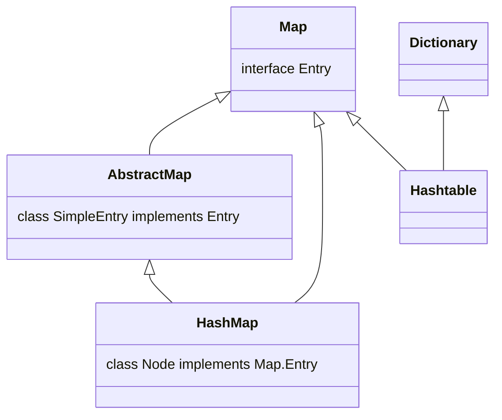

# `Map.Entry`、`HashMap.Node`和`HashTabel.Entry`的比较

先来看看`Map`,`HashMap`和`HashTable`的实现

## Map -- 只看里面的Entry

```java
public interface Map<K, V> {
    interface Entry<K, V> {
        
        K getKey();

        V getValue();

        V setValue(V value);

        boolean equals(Object o);

        int hashCode();

        public static <K, V extends Comparable<? super V>> Comparator<Map.Entry<K, V>> comparingByValue() {
            return (Comparator<Map.Entry<K, V>> & Serializable)
                (c1, c2) -> c1.getValue().compareTo(c2.getValue());
        }

        public static <K, V> Comparator<Map.Entry<K, V>> comparingByKey(Comparator<? super K> cmp) {
            Objects.requireNonNull(cmp);
            return (Comparator<Map.Entry<K, V>> & Serializable)
                (c1, c2) -> cmp.compare(c1.getKey(), c2.getKey());
        }

        public static <K, V> Comparator<Map.Entry<K, V>> comparingByValue(Comparator<? super V> cmp) {
            Objects.requireNonNull(cmp);
            return (Comparator<Map.Entry<K, V>> & Serializable)
                (c1, c2) -> cmp.compare(c1.getValue(), c2.getValue());
        }
    }
}
```

## HashMap

```java
public class HashMap<K,V> extends AbstractMap<K,V>
    implements Map<K,V>, Cloneable, Serializable {
    //HashMap$Node实现了Map$Entry
    static class Node<K,V> implements Map.Entry<K,V> {
    final int hash;
    final K key;
    V value;
    Node<K,V> next;

    Node(int hash, K key, V value, Node<K,V> next) {
        this.hash = hash;
        this.key = key;
        this.value = value;
        this.next = next;
    }

    public final K getKey()        { return key; }
    public final V getValue()      { return value; }
    public final String toString() { return key + "=" + value; }

    public final int hashCode() {
        return Objects.hashCode(key) ^ Objects.hashCode(value);
    }

    public final V setValue(V newValue) {
        V oldValue = value;
        value = newValue;
        return oldValue;
    }

    public final boolean equals(Object o) {
        if (o == this)
            return true;
        if (o instanceof Map.Entry) {
            Map.Entry<?,?> e = (Map.Entry<?,?>)o;
            if (Objects.equals(key, e.getKey()) &&
                Objects.equals(value, e.getValue()))
                return true;
        }
        return false;
    }
}
}
```


可以发现HashMap是继承自AbstractMap的，让我们来看一看它


## AbstarctMap

```java
public abstract class AbstractMap<K,V> implements Map<K,V>{
    public static class SimpleEntry<K,V>
        implements Entry<K,V>, java.io.Serializable
    {
        
    }
}
```

抽象类`AbstractMap`实现了`Map`接口，它的静态内部类`SimpleEntry`实现了`Map`里面的`Entry`

## HashTable

```java
public class Hashtable<K,V>
    extends Dictionary<K,V>
    implements Map<K,V>, Cloneable, java.io.Serializable {
    	
    }
```


# 总结




